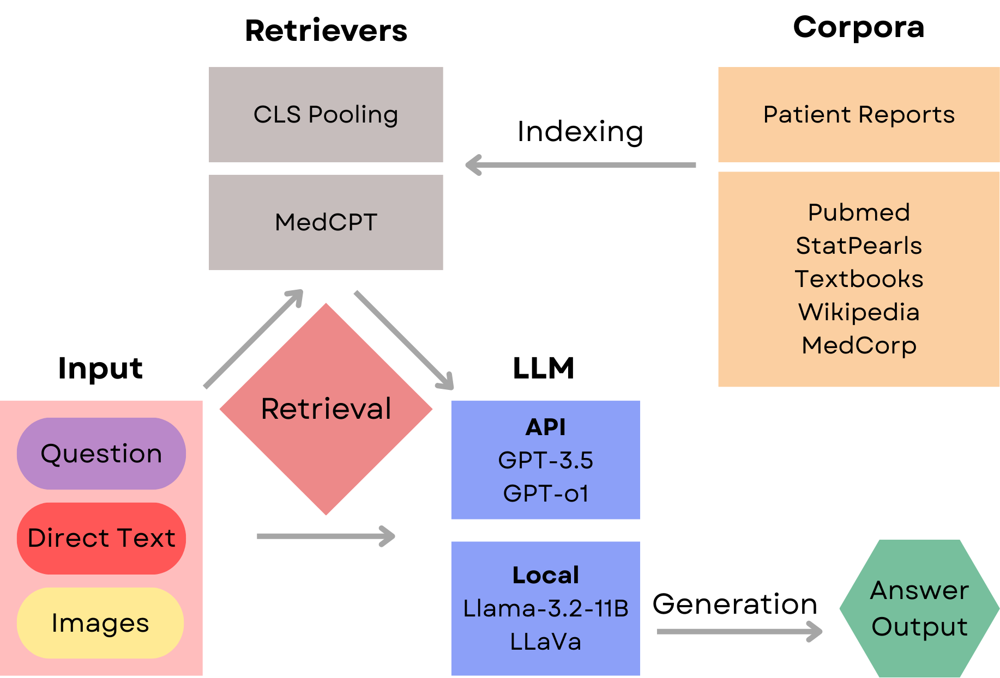
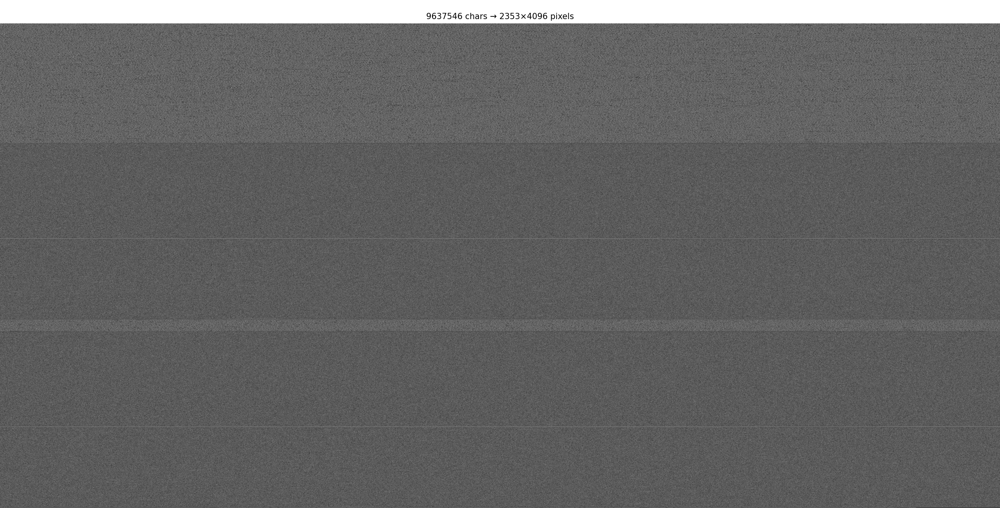
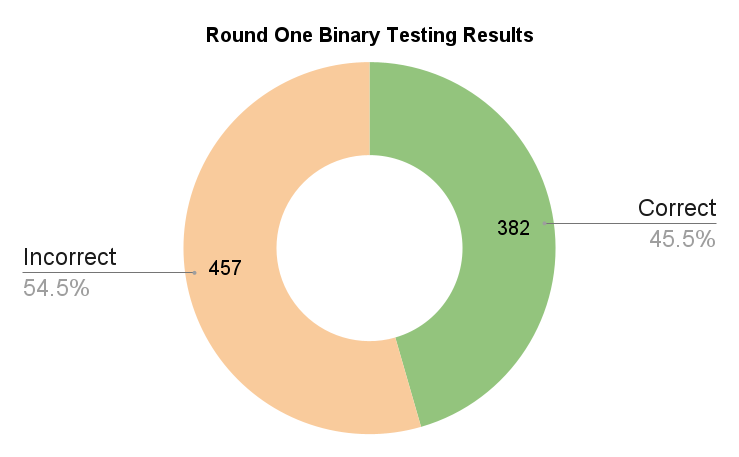
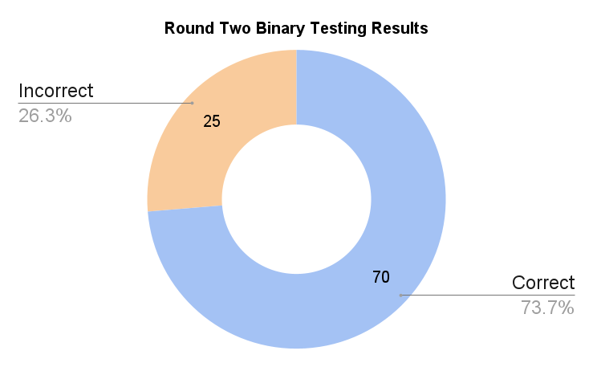

# MIRAGE

---

## Overview
MIRAGE is a Retrieval-Augmented Generation (RAG) system tailored for medical and scientific data analysis. It ingests user-provided text and images, retrieves relevant context from a pre-built corpus, and synthesizes answers via the OpenAI API. MIRAGE is designed for high flexibility, supporting multiple file types and visual inputs.


## Architecture Diagram
The following diagram illustrates the high-level components and data flow within MIRAGE:


*Figure: Core modules and data flow in MIRAGE.*

## Data Visualization Example


*Above is a visualization of all of the data from one input output cycle of the code.*


Below are comparisons of binary testing results over two rounds. These visualizations demonstrate improvements in accuracy and error reduction after system tuning:

### Round One Binary Testing


*Figure: Initial binary classification performance metrics.*

### Round Two Binary Testing


*Figure: Refined model performance after RAG integration.*

- [Poster](./resources/0ad59c96-a234-4c10-8855-484b9e4eb8d7.pdf)

## Code Structure and Workflow
The core code is organized as follows:

1. **Initialization & Configuration**  
   - Loads API credentials (`config.py`) and sets up the logging system.
   - Disables overly verbose third-party logs to focus on application messages.

2. **Image Handling**  
   - `image_paths_fn()`: Collects up to `IMG_MAX` images from `corpus/images`.
   - `encode_images()`: Reads each image file and encodes it to Base64 for embedding in API requests.

3. **Retrieval System**  
   - `RetrievalSystem` (in `utils.py`): Interfaces with the local document database to fetch relevant text snippets based on the user query.
   - `DocExtracter`: Extracts full document content when snippet IDs are provided.

4. **MedRAG Core**  
   - `MedRAG` class: Coordinates between retrieval, prompt construction, and API calls.  
   - `answer()`: Retrieves context, formats system/user messages (including embedded images), and calls `generate()`.
   - `generate()`: Invokes the OpenAI Chat Completions endpoint and returns the model’s response.

5. **End-to-End Processing**  
   - `process_selected_files()`: Entry point when files are selected in the UI.  
     - Encodes images, reads text files, concatenates content, and calls `MedRAG.answer()`.
     - Saves retrieved snippets and raw responses in the specified output directory.

## Usage
1. **Install dependencies**:
   ```bash
   pip install -r requirements.txt
   ```
2. **Prepare your corpus** under `./corpus` (manual input under `./corpus/textbooks/en`.
3. **Initiate corpus** by running Textbooks.py or other under `./data`.
4. **Configure** your OpenAI API key in `config.py`.
5. **Launch** the UI from the project root:
   ```bash
   python Main_UI.py
   ```
6. **Select** text and image files via the upload section, then submit your query.


## Release Notes
API key has been removed from this version

Llama version under Master

API version under Main

